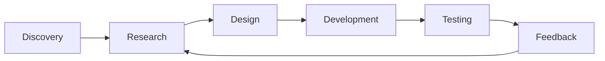

# Action Items

| No. | Action Item | Tujuan |
|---|---|---|
| 1 | Mempersempit customer persona | Mendapatkan target customer yang spesifik |
| 2 | Mengidentifikasi pain utama | Menghindari problem statement terlalu luas |
| 3 | Melakukan customer discovery | Memvalidasi masalah secara langsung |
| 4 | Menyusun pertanyaan interview | Mengurangi bias dan pertanyaan mengarahkan |
| 5 | Membuat prototype sederhana | Menguji value proposition sebelum development besar |
| 6 | Menguji prototype | Mendapatkan feedback nyata |
| 7 | Mengukur willingness/interest | Menilai potensi adopsi dan nilai solusi |
| 8 | Menguji business model | Memastikan potensi bisnis |
| 9 | Menganalisis hasil validasi | Menentukan langkah berikutnya |
| 10 | Reposition/pivot bila diperlukan | Menyesuaikan solusi berdasarkan evidence |

## Prinsip Pengembangan Produk

