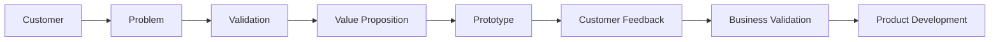

# Notulensi Workshop: Membangun dan Memvalidasi Value Proposition Startup

## Program Workshop

| Informasi | Keterangan |
|---|---|
| Tema | Membangun dan Memvalidasi Value Proposition Startup |
| Sesi | Workshop – Customer, Problem Validation, dan Value Proposition |
| Narasumber | Muhammad Rukawaludin (Kak Mumu) |
| Tanggal | Tidak tercantum dalam transcript |
| Platform | Pertemuan daring/Zoom |

## Tujuan Sesi

Workshop membahas cara membangun produk yang sesuai kebutuhan customer melalui proses:

1. Menentukan customer secara spesifik.
2. Menyusun customer persona.
3. Memahami dan memvalidasi problem.
4. Melakukan customer discovery dan interview.
5. Menguji hipotesis menggunakan prototype.
6. Memastikan solusi memiliki nilai bisnis.
7. Menentukan apakah solusi perlu dilanjutkan, diperbaiki, repositioning, atau pivot.

## Inti Workshop

> Pahami customer dan masalah terlebih dahulu sebelum membangun solusi atau teknologi.

## Alur Utama

## Kesimpulan

Startup yang kuat tidak dimulai dari teknologi, melainkan dari pemahaman terhadap customer dan masalah yang benar-benar mereka alami.

Urutan yang ditekankan:

**Kenali customer → Dengarkan customer → Gali masalah → Temukan akar masalah → Validasi asumsi → Rancang solusi → Uji → Perbaiki.**
