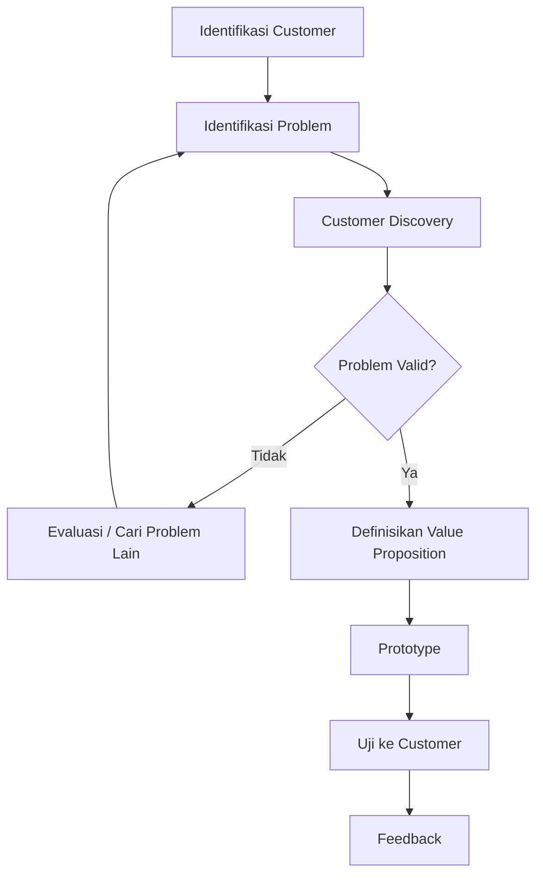

# Problem Validation

## Prinsip

Jangan langsung menawarkan solusi. Urutannya:

**Customer → Masalah → Tujuan → Solusi**

Masalah harus benar-benar dirasakan customer dan cukup penting untuk diselesaikan.

## Vitamin vs Painkiller

- **Vitamin:** memberikan manfaat tambahan.
- **Painkiller:** menyelesaikan masalah yang benar-benar dirasakan.

Semakin penting masalah bagi customer, semakin jelas alasan customer menggunakan atau membayar solusi.

## Proses Validasi

## Jika Problem Tidak Valid

Jangan langsung melakukan pivot. Analisis terlebih dahulu apakah masalahnya:

- Tidak valid.
- Terlalu kecil.
- Tidak cukup painful.
- Tidak sesuai dengan market.

Jika problem utama tidak valid, perubahan dapat menjadi lebih fundamental.
