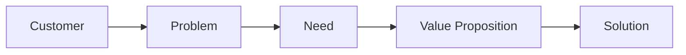

# Value Proposition

## Fokus

Value proposition harus menjawab kebutuhan dan masalah customer yang telah divalidasi.

Tiga pertanyaan penting:

1. Apakah customer membutuhkan solusi?
2. Apakah solusi benar-benar membantu?
3. Apakah value yang diberikan cukup jelas bagi customer?

## Framework

## Prinsip

- Jangan mulai dari teknologi.
- Jangan membangun produk terlalu besar di awal.
- Pastikan value proposition terkait dengan pain customer.
- Gunakan feedback customer untuk memperbaiki value proposition.

> Pahami → Validasi → Rancang → Uji → Perbaiki → Kembangkan
